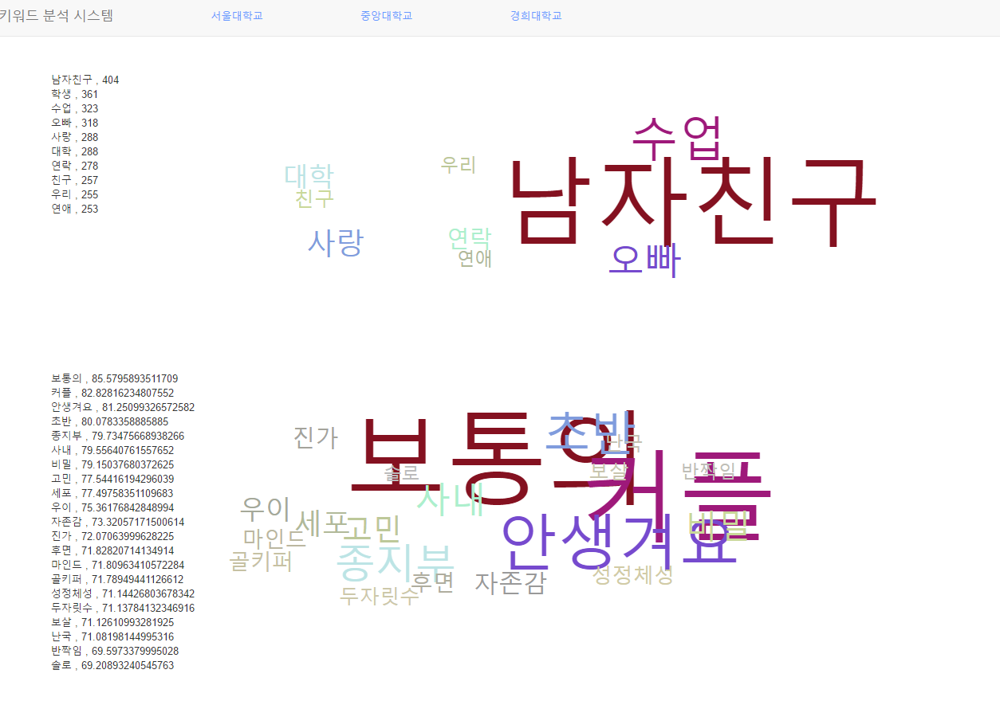

# keyword-analysis
Keyword analysis from Naver

If you need the data of the Facebook bamboo forest document used in this project, please e-mail us.

***takis0112@gmail.com***

# Results

## Requirements
* Python 3.5
* java 1.8
* node.js 6.10.2

## Open Source
* [facebook-api](https://developers.facebook.com/)
* [Komoran Morphologica analyzer](http://shineware.tistory.com/entry/KOMORAN-ver-24)
* [Twitter Morphological analyzer](https://github.com/twitter/twitter-korean-text)

`But we used the Komoran morpheme analyzer.`
* [Word2Vec](https://github.com/taki0112/Word2VecJava) 

`But I've rewrite it in Java. See JunhoKim github`

## Algorithm
* [Cosine Similarity](https://ko.wikipedia.org/wiki/%EC%BD%94%EC%82%AC%EC%9D%B8_%EC%9C%A0%EC%82%AC%EB%8F%84)
* [TF-IDF](https://ko.wikipedia.org/wiki/TF-IDF)

## Screenshot (Kyunghee University Keyword & Words related to "연애")


## Optional
* Data Visualization in Web (Word cloud)
```bash
Keyword = DF * (1/log_3(Rank) * (1/5)
Associated word = Cosine similarity * 1000 * (1/log_3(Rank) 
```

## Author
Junho Kim, JungHyun Park, SeonYeong O
